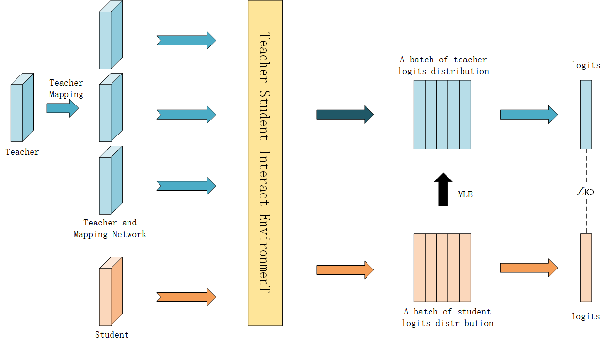

# Stimulate Student Ability Via Reinforcement Learning
The PyTorch Implementation of 'Stimulate Student Ability Via Reinforcement Learning'

code is coming soon!

## Environment Require
PyTorch >= 1.7.1 CUDA >= 9.2 Python >= 3.7

## Update 
- [√] Update some experiments result
- [ ] Update base code
- [ ] Update core code
- [ ] Update visualization code

## Quick Running
[Download](https://drive.google.com/drive/folders/1nrGFtIEm2mUBh5ET5tl32Qt4az1O7Gqb) experiment student model path

## Result in same architectures style on CIFAR100
<table>
	<tr><td>Teacher</td><td>WRN-40-2   75.61 </td><td>WRN-40-2   75.61 </td><td>Resnet56   72.34 </td>
	<td>Resnet32×4   79.42 </td><td>VGG13   74.64 </td></tr>
	<tr><td>Student</td><td>WRN-16-2   73.26 </td><td>WRN-40-1   73.26 </td><td>Resnet20   69.06 </td>
	<td>Resnet8×4   72.50 </td><td>VGG8   70.36 </td></tr>
	<tr><td>KD</td><td>74.92</td><td>73.54</td><td>70.66</td><td>73.33</td><td>72.98</td></tr>
	<tr><td>FitNet</td><td>73.58</td><td>72.24</td><td>69.21</td><td>73.50</td><td>71.02</td></tr>
	<tr><td>AT</td><td>74.08</td><td>72.77</td><td>70.55</td><td>73.44</td><td>71.43</td></tr>
	<tr><td>SP</td><td>73.83</td><td>72.43</td><td>69.67</td><td>72.94</td><td>72.68</td></tr>
	<tr><td>VID</td><td>74.11</td><td>73.30</td><td>70.38</td><td>73.09</td><td>71.23</td></tr>
	<tr><td>RKD</td><td>73.35</td><td>72.22</td><td>69.61</td><td>71.90</td><td>71.48</td></tr>
	<tr><td>PKT</td><td>74.54</td><td>73.45</td><td>70.34</td><td>73.64</td><td>72.88</td></tr>
	<tr><td>CRD</td><td>75.64</td><td>74.38</td><td>71.63</td><td>75.46</td><td>74.29</td></tr>
	<tr><td>WCoRD</td><td>76.11</td><td>74.72</td><td>71.92</td><td>76.15</td><td>74.72</td></tr>
	<tr><td>ReviewKD</td><td>76.12</td><td>75.09</td><td>71.89</td><td>75.63</td><td>74.84</td></tr>
	<tr><td>SSKD</td><td>75.66</td><td>75.27</td><td>70.96</td><td>75.80</td><td>175.1223</td></tr>
	<tr><td>RLTF-KD</td> <td>75.65   <b>(+0.73)</b> </td><td> 73.65   <b>(+0.11)</b> </td>
	<td>70.70   <b>(+0.04)</b> </td><td>75.24   <b>(+1.91)</b> </td><td>74.04   <b>(+1.06)</b></td></tr>
	<tr><td>RLTF-PKT</td><td>75.20   <b>(+0.66)</b></td><td>73.93   <b>(+0.48)</b></td>
	<td>70.56   <b>(+0.22)</b></td><td>75.98   <b>(+2.34)</b></td><td>73.89   <b>(+1.01)</b></td></tr>
	<tr><td>RLTF-CRD</td><td>75.51   <b>(-0.13)</b></td><td>74.82   <b>(+0.44)</b></td>
	<td>71.53   <b>(-0.10)</b></td><td>76.01   <b>(+0.55)</b></td><td>74.69   <b>(+0.40)</b></td></tr>
</table>

## Result in cross architectures style on CIFAR100
<table>
	<tr><td>Teacher</td><td>VGG13   74.64</td><td>Resnet50   79.34</td>
	<td>Resnet50   79.34</td><td>Resnet32×4   79.42</td><td>Resnet32×4   79.42</td><td>WRN40-2   75.61</td></tr>
	<tr><td>Student</td><td>MobileNetV2   64.60</td><td>MobileNetV2   64.60</td><td>VGG8   70.36</td>
	<td>ShuffleNetV1   70.50</td><td>ShuffleNetV2   71.82</td><td>ShuffleNetV1   70.50</td></tr>
	<tr><td>KD</td><td>67.37</td><td>67.35</td><td>73.81</td><td>74.07</td><td>74.45</td><td>74.83</td></tr>
	<tr><td>FitNet</td><td>64.14</td><td>63.16</td><td>70.69</td><td>73.59</td><td>73.54</td><td>73.73</td></tr>
	<tr><td>AT</td><td>59.40</td><td>58.58</td><td>71.84</td><td>71.73</td><td>72.73</td><td>73.32</td></tr> 
	<tr><td>SP</td><td>66.30</td><td>68.08</td><td>73.34</td><td>73.48 </td><td>74.56</td><td>74.52</td></tr>
	<tr><td>VID</td><td>65.56</td><td>67.57</td><td>70.30</td><td>73.38</td><td>73.40</td><td>73.61</td></tr>
	<tr><td>RKD</td><td>64.52</td><td>64.43</td><td>71.50</td><td>72.28</td><td>73.21</td><td>72.21</td></tr>
	<tr><td>PKT</td><td>67.13 </td><td>66.52</td><td>73.01</td><td>74.10</td><td>74.69</td><td>73.89</td></tr>
	<tr><td>CRD</td><td>69.94</td><td>69.54</td><td>74.58</td><td>75.12</td><td>76.05</td><td>76.27</td></tr>
	<tr><td>WCoRD</td><td>70.02</td><td>70.12</td><td>74.68</td><td>75.77</td><td>76.48</td><td>76.68</td></tr>
	<tr><td>ReviewKD</td><td>70.37</td><td>69.89</td><td>-</td><td>77.45</td><td>77.78</td><td>77.14</td></tr>
	<tr><td>SSKD</td><td>70.92</td><td>71.14</td><td>75.72</td><td>77.91</td><td>78.37</td><td>76.92</td></tr>
	<tr><td>RLTF-KD</td><td>68.27   <b>(+0.90)</b></td><td>67.52   <b>(+0.17)</b></td>
	<td>74.26   <b>(+0.45)</b></td><td>75.43   <b>(+1.36)</b></td><td>75.01   <b>(+0.56)</b></td><td>76.02   <b>(+1.19)</b></td></tr>
	<tr><td>RLTF-PKT</td><td>67.90   <b>(+0.77)</b></td><td>68.36   <b>(+1.84)</b></td>
	<td>74.68   <b>(+1.67)</b></td><td>75.67   <b>(+1.57)</b></td><td>75.25   <b>(+0.56)</b></td><td>76.25   <b>(+2.36)</b></td></tr>
	<tr><td>RLTF-CRD</td><td>69.89   <b>(-0.05)</b></td><td>69.51   <b>(-0.03)</b></td>
	<td>74.62   <b>(+0.04)</b></td><td>75.80   <b>(+0.68)</b></td><td>76.17   <b>(+0.12)</b></td><td>76.21   <b>(-0.06)</b></td></tr>
</table>

## Acknowledgement
The implementation of code and model is borrowed from https://github.com/HobbitLong/RepDistiller

----