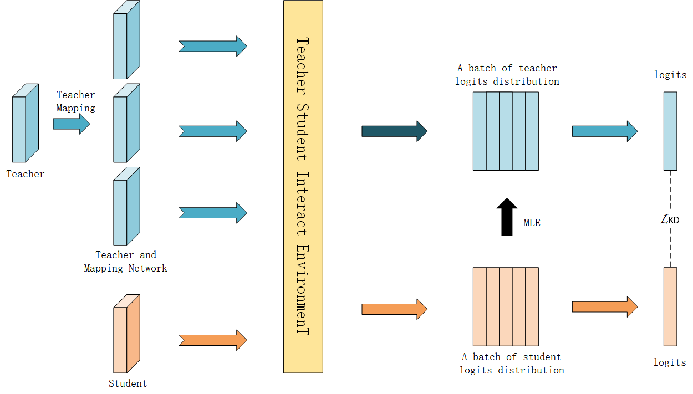

# RLTF
This is the GitHub page for the paper Stimulate Knowledge Distillation Ability Via Reinforcement Learning

<p align="center">
  
</p>

## Prerequisite
PyTorch >= 1.10.0 and CUDA >= 10.2 

## Running

### Teacher Training

Example of teacher model training: 

```python train_teacher.py --model resnet32x4 --gpu_id 0 --trial 0 --dataset cifar100```

You can also download all the pre-trained teacher models with `scripts/fetch_pretrained_teachers.sh`.

### Student Training
Example of student model training:

`python train_student.py --epochs 240 --path_t ./save/models/resnet32x4_vanilla/ckpt_epoch_240.pth --distill kd --model_s resnet8x4 -r 0.1 -a 0.9 -b 0 --trial 1 --sample_data 32 --number_teacher 3 --noiseMLE 0.5`

The meanings of important flags are:

`-- path_t`: teacher's checkpoint path.

`--distill`: distillation type.

`--model_s`: student's architecture.

`--sample_data`: sample data in mini batch, the detail can see method section in our paper.

`--number_teacher`: teacher mapping number.

`--noiseMLE`: MLE noise setting.

### Student Testing in RLTF
We provides some of studnets path of our method to quick check. The link is [here](https://drive.google.com/drive/folders/1RzYPMwaHh1mM5mgSADRoiI5SLVgk8ie6).

Explanation of the student file folder we provide.

`vgg8_T_vgg13_cifar100_pkt` means the student network is `vgg8`and the teacher network is `vgg13` on `cifar100` dataset training, the distillation method is `pkd + RLTF` result.

Example of student model testing:

`python student_val.py --path_t ./student/resnet8x4_T_resnet32x4_cifar100_pkt/resnet8x4_best.pth`

`--path_t` means the student's checkpoint path.

## TODOs
- [ ] Visualization code and demo
- [x] Student testing path
- [x] Student training code
- [x] Teacher training code

## Acknowledge

The implementation of `models` is borrowed from [CRD](https://github.com/HobbitLong/RepDistiller)